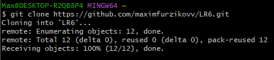
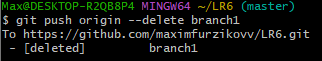

# LR6
## Лабораторная работа №6
### Цель лабораторной работы: изучение базовых возможностей системы управления версиями, опыт работы с Git Api, опыт работы с локальным и удаленным репозиторием.
### 1. Создание аккаунта на сайте GitHub
В работе использовался уже имеющийся аккаунт на сайте GitHub. На сайте была сделана копия из https://github.com/Kurtyanik/LR6/ (Fork). С помощью GitBash были изменены имя и почта. (см. рис. 1)

Рисунок 1 - Изменение имени пользователя и почты
### 2. Клонирование удаленного репозитория на комьютер
Клонирование репозитория было выполнены с помощью команды git clone (см. рис. 2).

Рисунок 2 - Клонирование репозитория
### 3. Добавление файла через интерфейс GitHub
В ветке master с помощью интерфейса GitHub был создан файл "NewFile.txt". С помощью команды git pull origin master изменения были подтянуты в локальный репозиторий (см. рис. 3).

Рисунок 3 - Добавление файла и подтягивание изменений
### 4. Получение истории операций для каждой из веток
С помощью git log --all были получены истории операций для каждой из веток (см. рис. 4).

Рисунок 4 - История операций
### 5. Просмотр последних изменений.
Для просмотра последних изменений была использована команда git show (см. рис. 5).

Рисунок 5 - Просмотр последних изменений.
### 6. Слияение в ветку master с разрешением конфликта
Затем было выполнено слияние в ветку master с помощью команды git merge origin/branch1 origin/master (см. рис. 6). Возник конфликт, для разрешения которого были удалены некоторые данные из файла mergefile.txt.

Рисунок 6 - Слияние веток
Данные изменения были сохранены (см. рис. 7).

Рисунок 7 - Сохранение изменений
### 7. Удаление побочной ветки после успешного слияния
С помощью git push origin --delete branch1 была удалена побочная ветка (см. рис. 8).

Рисунок 8 - Удаление побочной ветки
### 8. Выполнение изменений и их фиксирование
Затем, в файл mergefile.txt были внесены изменения, которые позже были зафиксированы (см. рис. 9).

Рисунок 9 - Внесение изменений и их фиксирование.
### 9. Откат коммита
Затем был осуществлен откат коммита - git revert c06f031 (см. рис. 10).

Рисунок 10 - Откат коммита
### 10. Создание ветки для отчета

Рисунок 11 - Создание ветки report для оформления отчета
### 11. История операций в форматированном виде

Рисунок 12 - История операций для ветки master

Рисунок 13 - История операций для ветки report
### 12. Лог команд
git config
git clone
git pull
git log
git show
git merge
git commit -m
git push
git add .
git revert
git branch
git checkout
git log --pretty=format:"%h + %cd +%an + %s"
### Вывод: были изучены базовые возможности системы управления версиями, получен опыт работы с Git Api, с локальным и удаленным репозиторием.
